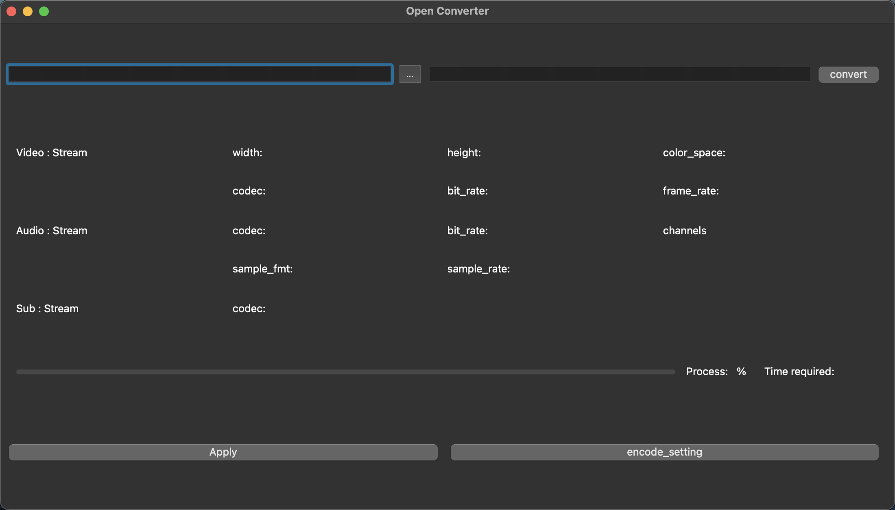
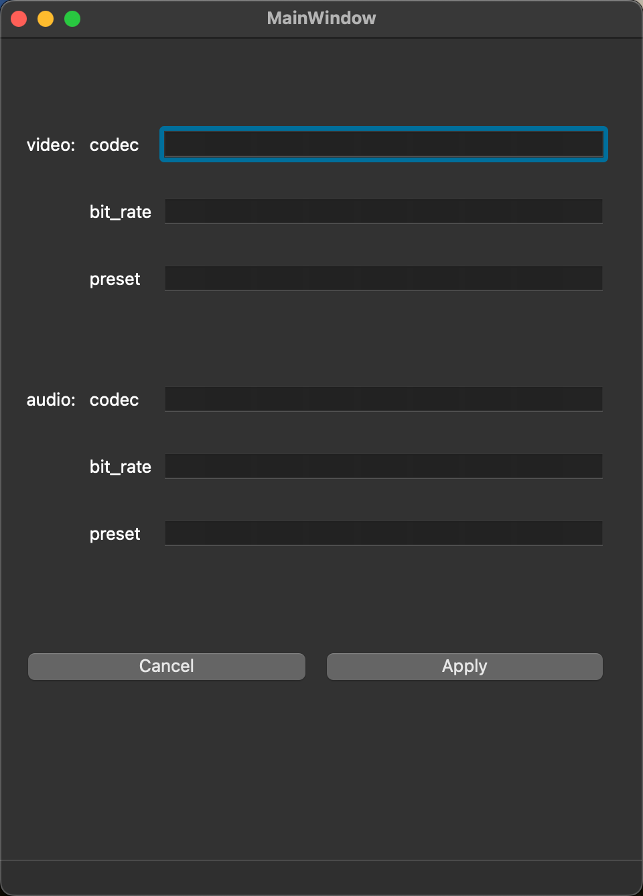

# OpenConverter

## 📢  Project Introduction

OpenConverter is a software built on the **FFmpeg** source code and the **Qt** open source framework. It provides a set of easy-to-use tools for conveniently converting, editing, and processing audio and video files.

This converter has the following main features:

1. Supports changing video codecs for encoding(e.g., libx264, libx265).
2. Supports transcoding multimedia without re-encoding.
3. Supports displaying information about video and audio streams in multimedia files.
4. Supports showing progress while converting files.
5. Supports opening files from the file manager.

This project is developed using the [Qt framework](./doc/Qt.md) and the FFmpeg libav library。

FFmpeg development tutorial can be reference at [Learn FFmpeg the Hard Way](https://github.com/TSGU-OSC/Learn_FFmpeg_the_Hard_Way)

## 🌟  Detailed Fucionality

After running OpenConverter, you can see and use the following functions:

### 1. Support for changing video codecs for encoding（e.g.,libx264，libx265）

This converter allows users to easily change the video codec, so that different encoders can be used during the conversion process. For example, you can choose to use the libx264 or libx265 encoder to achieve higher compression rates and better video quality.

### 2. Support for media transcoding without re-encoding

This converter also supports transcoding multimedia files without re-encoding. This means you can directly convert files from one format to another without changing the original video and audio streams. This is very useful for quickly convering files.

### 3. Support for displaying information about video and audio streams in multimedia files

This converter can display detailed information about video and audio streams, including resolution, frame rate, bitrate, and more. This helps you understand the properties of multimedia files, so that you can make appropriate adjustments during the converion process.

### 4. Support for displaying progress during file conversion

When converting files, this player will display the conversion progress in real-time, so that you can understand the time required for the conversion process. This helps you better plan your time and avoid unnecessary waiting.

### 5. Support for opening files from the file manager

This converter supports directly opening multimedia files from Finder or other file managers. This makes file management more straightforward, making it easier for you to quickly find and open the files you need to convert.

## 📖 Contribution Guide

If you are interested in contributing to the project or have found any issues, please refer to our [Contribution Guide](./CONTRIBUTING.md)

## ☘️ License

OpenConverter is an open-source project licensed under the Apache 2.0 license. Please read it before using. [LICENSE](./LICENSE) file。
