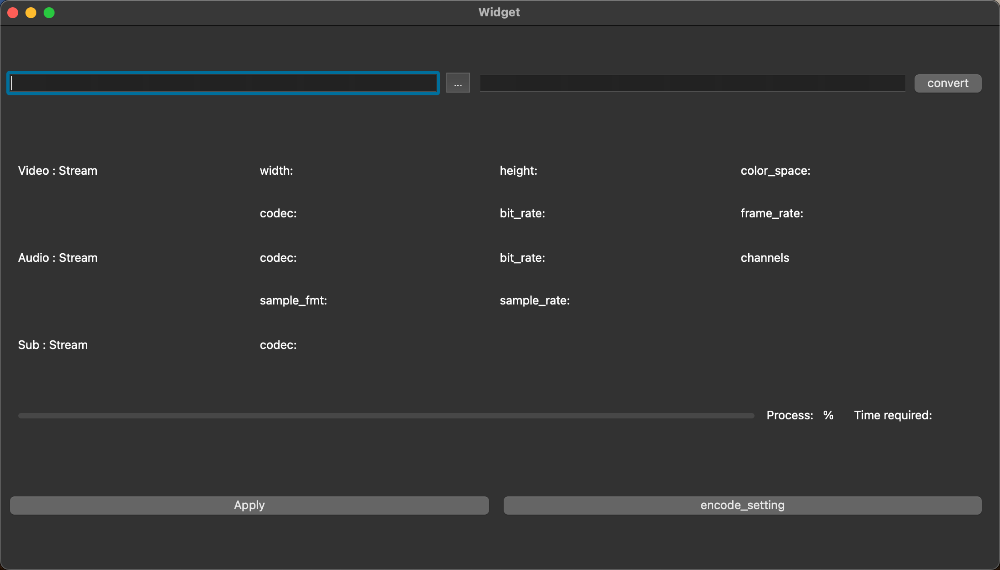

# OpenConverter

## 📢  项目介绍

OpenConverter 是一个基于 **FFmpeg**源代码、**Qt**开源框架构建的软件，它提供了一些简单易用的工具，可以方便地转换、编辑和处理音视频文件。

这款转换器具有以下主要功能：

1. 支持更改视频编解码器以进行编码（例如libx264，libx265）
2. 支持无编码转换多媒体。
3. 支持显示多媒体文件中视频和音频流的信息。
4. 支持在转换文件时显示进度。
5. 支持从文件管理器中打开文件。

本项目使用[Qt框架](./doc/Qt.md)和FFmpeg libav库完成开发。

## 💾 项目准备

#### 1.  [**Git介绍**](./doc/git-command.md)

#### 2. [**Windows终端命令**](./doc/Windows-command.md)

#### 3. [**Qt工程文件学习模版**](./doc/project_learn)

#### 4. **关于FFmpeg**

##### ffmpeg介绍

FFmpeg是一套**开源**的跨平台音视频处理工具，可以用来录制、转换和流式传输音视频文件。FFmpeg由C语言编写而成，支持多种操作系统，包括Windows、Linux、macOS等。

- [FFmpeg官网](https://www.ffmpeg.org/)

- [FFmpeg下载](https://ffmpeg.org/download.html)

- [FFmpeg官方文档](http://ffmpeg.org/ffmpeg-all.html)

- [FFmpeg教程](https://www.wikiwand.com/en/FFmpeg)

##### FFmpeg核心库及其工具

FFmpeg提供了一些核心库和工具，使得开发者能够方便地处理视频和音频文件，支持的功能包括：

* **视频编解码**：支持多种视频格式的编解码，如MPEG-4、H.264、VP8等。
* **音频编解码**：支持多种音频格式的编解码，如MP3、AAC、FLAC等。
* **视频过滤器**：支持对视频进行裁剪、缩放、旋转等操作，还支持添加水印、边框等特效。
* **音频过滤器**：支持对音频进行降噪、混响、均衡器等处理。
* **流媒体处理**：支持从网络摄像头、麦克风等设备抓取输入，并将处理后的数据输出到网络或本地文件。

## 🌟  功能详解

运行 OpenConverter 后，您可以看到并使用以下功能：

### 1. 支持更改视频编解码器以进行编码（例如libx264，libx265）

这款转换器允许用户轻松地更改视频编解码器，以便在转换过程中使用不同的编码器。例如，您可以选择使用libx264或libx265编码器，以获得更高的压缩率和更好的视频质量。

### 2. 支持无编码转换多媒体。

该转换器还支持无需编码即可转换多媒体文件。这意味着您可以在不改变原始视频和音频流的情况下，直接将文件从一种格式转换为另一种格式。这对于快速转换文件非常有用。

### 3. 支持显示多媒体文件中视频和音频流的信息

这款转换器可以显示有关视频和音频流的详细信息，包括分辨率、帧率、比特率等。这有助于您了解多媒体文件的属性，以便在转换过程中进行相应的调整。

### 4. 支持在转换文件时显示进度

在转换文件时，该播放器会实时显示转换进度，以便您了解转换过程所需的时间。这有助于您更好地安排时间，避免不必要的等待。

### 5. 支持从文件管理器中打开文件

该转换器支持从Finder或其他文件管理器中直接打开多媒体文件。这使得文件管理变得更加简单，方便您快速找到并打开需要转换的文件。

## 📖 贡献指南

如果你有兴趣贡献项目或发现了错误，请参考我们的 [贡献指南](./CONTRIBUTING.md)

## ☘️ 许可证

OpenConverter 是基于 Apache 2.0 许可证开源的。请在使用前阅读 LICENSE 文件。
